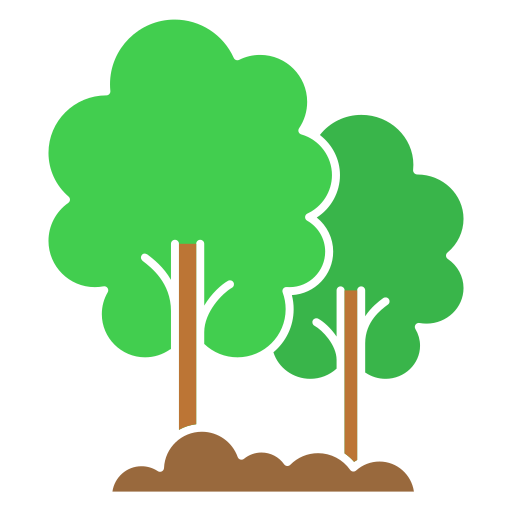

# grevia

<!-- Logo at the top, centered -->
<p align="center">
  
</p>

<h1 align="center" style="color:#2ecc40;">
  🌱 Grevia Focus: Turn Focus Into Growth 🌳
</h1>

<p align="center">
  
  
  
</p>

---

## 🌿 What is Grevia Focus?

**Grevia Focus** is a productivity app that transforms your focus sessions into the growth of beautiful virtual trees. Every time you complete a Pomodoro-style session, your tree grows. When your tree is fully grown, we plant a real tree for you! 🌍

---

## 🍃 Features

- **Pomodoro Timer** ⏲️  
  Stay focused with customizable session durations.

- **Virtual Tree Growth** 🌱🌳  
  Watch your tree grow with every completed session.

- **Real Tree Planting** 🌲  
  Complete a tree in the app, and we plant a real one for you.

- **Personal Forest & Progress** 🌳🌳  
  Track your trees, focus stats, and streaks.

- **Level Up & Unlock Trees** 🏆  
  Gain levels, unlock new tree types, and earn achievements.

- **Adaptive Green UI** 💚  
  Stunning green-themed interface that adapts to your chosen background.

- **Weather Integration** ☀️🌧️  
  See your local weather and let it influence your forest's mood.

- **Customizable Backgrounds** 🖼️  
  Choose from beautiful green backgrounds to personalize your experience.

- **Achievements & Leaderboards** 🥇  
  Earn badges and see how you rank among other users.

- **Privacy First** 🔒  
  Your data is secure and only you can access your stats.

---

## 🌳 How It Works

1. **Sign Up / Log In**  
   Create your account or log in securely.

2. **Set Your Focus Preferences**  
   Choose your session duration and favorite tree type.

3. **Start a Focus Session**  
   Begin a Pomodoro timer. Stay focused—pausing or leaving the app pauses your tree's growth.

4. **Grow Your Tree**  
   Each completed session grows your virtual tree. Missed sessions slow its growth.

5. **Complete & Plant**  
   When your tree is fully grown, we plant a real tree for you and start a new one!

6. **Track Your Progress**  
   View your stats, streaks, and achievements in the Stats tab.

7. **Customize Your Experience**  
   Change backgrounds, manage notifications, and edit your profile in Settings.

---

## 🌱 Screenshots

<p align="center">
  
  
  
</p>

---

## 🚀 Getting Started

1. **Clone the repo:**
   ```bash
   git clone https://github.com/yourusername/grevia.git
   cd grevia
   ```

2. **Install dependencies:**
   ```bash
   flutter pub get
   ```

3. **Run the app:**
   ```bash
   flutter run
   ```

---

## 🛠️ Tech Stack

- **Flutter** (Dart)
- **Firebase** (Auth, Realtime Database)
- **Shared Preferences**
- **Animations & Adaptive UI**

---

## 💚 Contributing

Pull requests are welcome! For major changes, please open an issue first.

---

## 📧 Contact

- **Developer:** Sanjay  
- **Email:** sanjay13649@gmail.com  
- **Website:** [sanjaywork.netlify.app](https://sanjaywork.netlify.app/)

---

<p align="center" style="color:#229954;">
  Made with 💚 and focus for a greener world.
</p>
